+++
title = "Beyond Boarder - A trip to Tokyo"
date = 2019-08-18
+++

> As the first time to go abroad, I go to the Tokyo which is one of the
> mega cities in Asia. I hereby write down what have been shown in
> Journey and something more.

# Day 1

It\'s August 18^th^ the first day of the journey. I was a kind of
excited in the morning before boarding because this journey would be my
first trip abroad in combination of the first trip I would take alone.\
## First touch
At 11:50 AM (UTC+8), I took off and I landed in NRT
International Airport in Tokyo at 4:30 PM (UTC+9). At the process of
custom declaration, I found out that the fact that many elders were
still on their position of work, which reflected the ageing. I had no
photo here because of the prohibition of taking photo in Japan custom.\
The subway system annoyed me a little bit for the first time. They have
different types of train like Local, Limited Express, Commuter Express
and so on. The difference between these types is the number of stops.
And since the subway system is privatized, many different companies had
involved in it, giving you a confusing fact that why some lines cannot
transfer to another line.\
After taking a long way of subway from NRT to my residential, I ate the
Sukiya around it. Somehow, it was delicious anyway because I had took a
long ride of subway from NRT the place far away from the residential
although it isn\'t in the downtown also. The place in which my
residential is gave me a sense of mixture of retro and progressive.
Building\'s in the town are quite old since they are in the style of
80s. However, in the relatively speaking downtown area in that town, the
area around the subway station which is also very old-fashion like, they
have got all kind of stores that they need actually with the guaranteed
service because almost all of them are chain stores. Step into the old
buildings, you can find a sense of neat which is also scattered at
everywhere in the city. That was my first sense to tokyo since I had not
got to the downtown actually.

## Tokyo Ignitions

In the first night, I went to the Tokyo Metropolitan Government Building
Observatory alone by riding the Shinjuku line to the Shinjuku station.
Station of Shinjuku is quite big and you may lost in it since it have
got 6 floors and countless entries and exits.\
The observatory is at floor 45 and free for everyone. Many foreigners in
it since it is the almost best place to gaze afar in Tokyo. I came it in
the night, so I had got some night scenes:\
\
\
\
\
\
 Not very sharp since I had
not got a tripod.\
After taking photo, I hung out in Shinjuku for about 1 hour and came
back to residential at 10:40 PM.\
\
\
# Day 2

> I have got the sense of living here.\
> People not stirve to competition,\
> But setting higher standards,\
> Taking the right order and proceeding on.\
> -- Tokyo Metro staff, Making Tokyo Moving

## Beginning of the day

I awoke at 6:30 PM. It was a great day of experience of local life in
Tokyo. With unamed flavor of fragmance scattered in air, I went to the
7-Eleven store which laid one blocks away from my residential to buy my
breakfirst for today. I bought a sandwhich and a bottle of medium size
milk. Guess what? They have costed me JPY 500 with which I can have a
lunch well done in UTokyo (I will mention it later).\
After a quick-charge, I got onto the road to start today\'s Journey
which is taking Metro to the Tokyo National Museum and all the other
museums around here, taking Metro again to the Ginza and visiting
Intermediatheque, finally obtaining the ticket of Imperial Palace tour.
Everything went on quickly and normally, I bought the one-day pass for
both TOEI and Tokyo Metro so I can easily do unlimited transfer and take
the metros in all the lines which are operated by these two companies.
With the instructions and tutorials from Google Maps, I sought the way
out quickly and took turns in intricate ways. However and most
importantly, **all the museums were closed today since it was Monday.**
Well, you can guess what I felt after walking about 3 km but found all
of them were closed.\
## The university of Tokyo
In addition to the bad luck of having wrong
day to visit the museums, It began to rain quickly. I had nothing to say
but thinking this morning had been spoiled. Shooting the dice, I went to
the University of Tokyo near here to see if anything can be found. Well,
it is said that *Authorized Staff or Invited Visitors only* on the gate.
However, after a while of hesitation, I stepped in this rust gate,
throwing all the cautions to the winds. As I walked on the lanes, no
visitors at all. All people in sight were undergraduate students,
graduate students in combination of professors and staff like janitors
and deans. A kind of embarrassment, right? I shot as walk, here are some
pictures:\
\
\
\
\
\
From my perception, UTokyo is a western university in eastern
hemisphere. All the western like projects, associations, institutions
and clubs can all be found in UTokyo which is a top university in both
Asia and the world. In UTokyo, you can join the lectures which are held
by other worldwide top universities such as UChicago, UCLA or UC
Berkeley. As I saw, there was one poster right on the bulletin board and
several pamphlets announced such a lecture.\
## Great university by great cafeteria! 
The presence of great
cafeterias inside the campus is one of the most crucial prerequisites
for becoming a great university (kidding). There was no exception for
UTokyo either. I bought some exclusive stationary with slogan of UTokyo
on them in campus shop and got into the central cafeteria of UTokyo.\
\
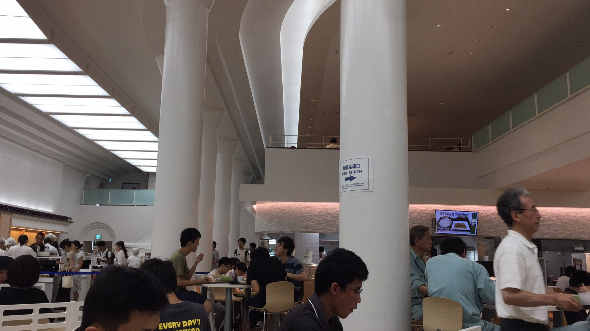\
\
Dishes on the menus were very cheap, because of the absence of Rimen, I
chose the medium size Miso Rimen (actually quite big) in combination of
mashed potato salad. Two of them for JPY 490 only!\
Unusual experience of having lunch surrounded by a bunch of university
students and professors. Like it!\
\
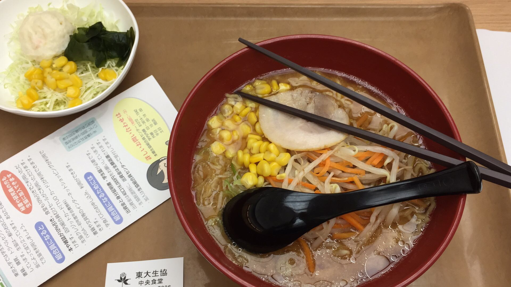\
\
One anecdote in cafeteria is that I went to the cashier 3 without
noticing the \'no cash\' sign in front of it. However, when I was trying
the bill, the attendant asked me to swipe the card to pay. There was
only one idea stroke my mind: I have to use student card which I\'m not
eligible to have to pay. After conversing with her, I realized my
negligence of \'no cash\' sign and went to the cashier 1 instead.

## Ginza

Few of us will deny that Ginza district in a sense is the heart or the
Tokyo and a symbol of prosperity of Tokyo.\
\
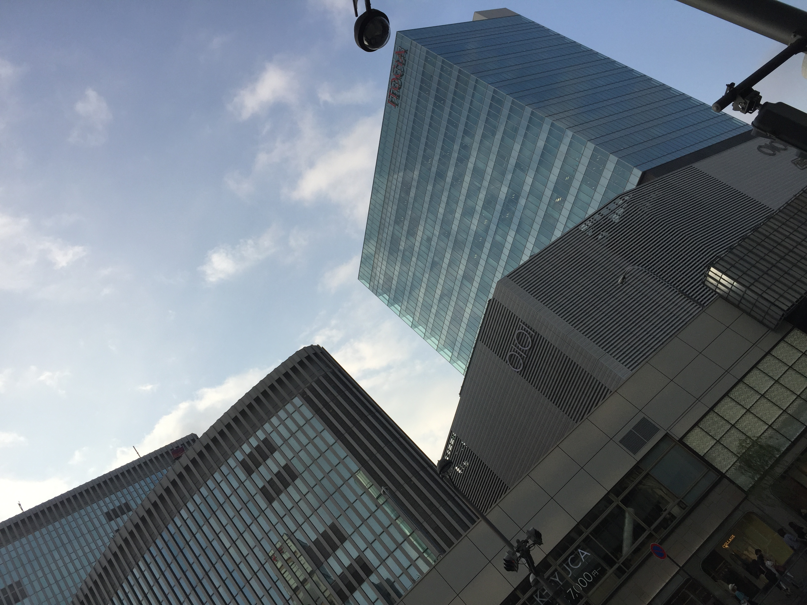\
\
Therefore, I went to the Ginza and hung out in a little part of it for
an afternoon. I went to the Apple Ginza firstly. Without doubt, it is
elegant in almost every aspects and I also found the Apple TV which was
not allowed to sell in mainland China.\
\
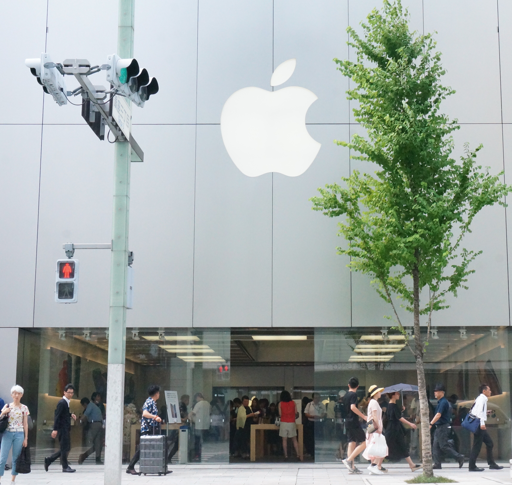\
\
Anyway, I didn\'t buy anything in Apple Store because it is also
expansive in almost every aspects.\
I also visited the world biggest UNIQLO which has 11 floors and a lots
of exclusive products.\
\
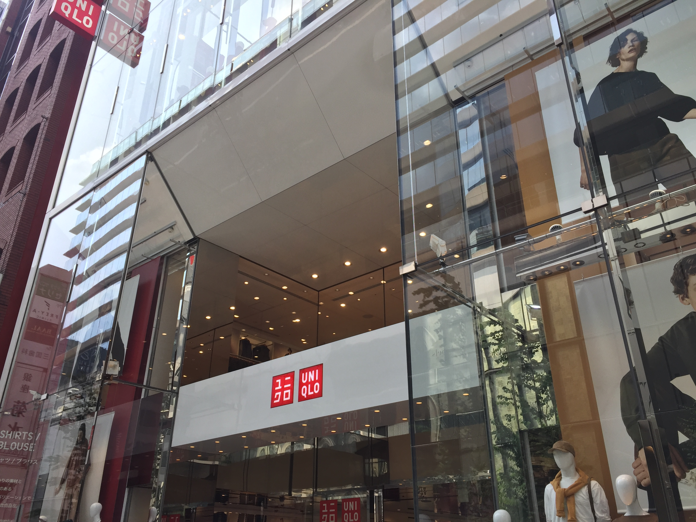\
\
I got around all the floors but somehow bought nothing since I was not
interested in apparels at all.\
And finally, I went to the itoya which is a mega stationary store which
has compounded almost everything related to the stationary and even
more.\
\
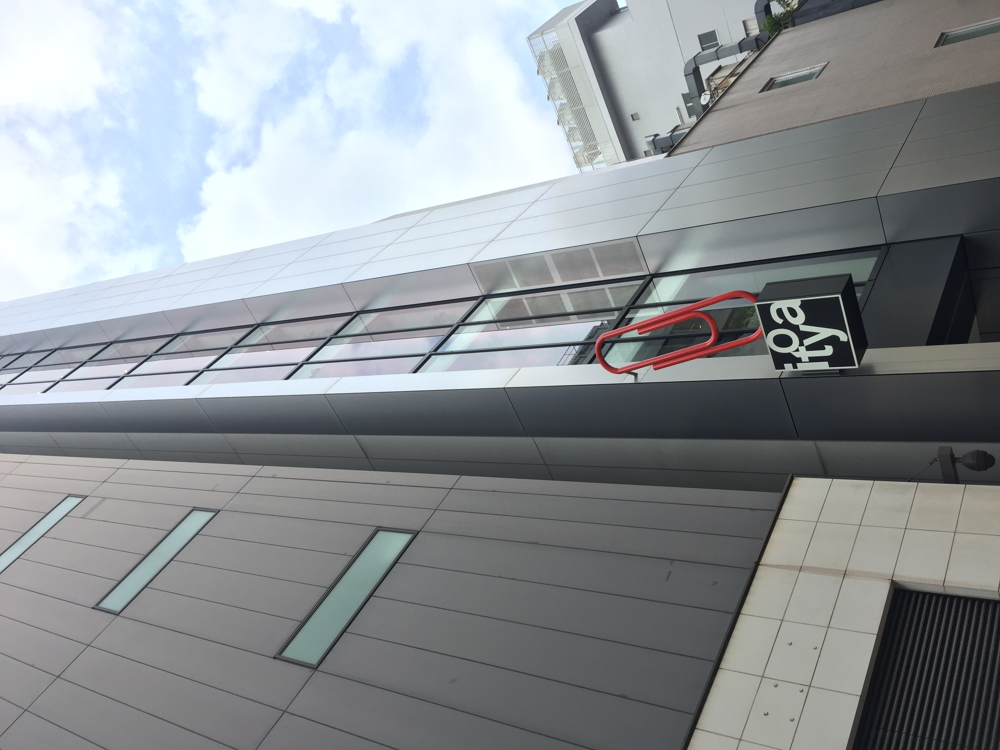\
\
I bought some pens and mechanical pencils. And that\'s all.\
After walking for whole afternoon, I went to a Starbucks near one
crossing and purchased a cup of TEAVANA. Another anecdote here: I asked
for lemonade flavor TEAVANA but the attendant just couldn\'t understand.
So I looked up the menu but found that although the items\' name were
annotated by English, the flavors weren\'t. So he listed all the flavors
one by one but somehow I just could not understand. In the end, I
ordered a Grande cup of black tea TEAVANA but it turned out to comprise
of black tea, ice cubes but no sugar or syrup.\
\
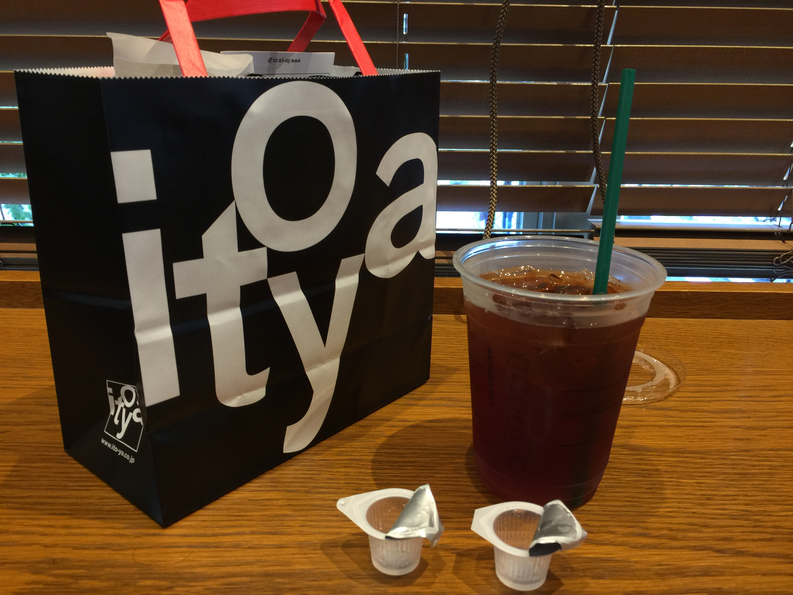\
\

# Day 3

## MOMAT

As I mentioned yesterday, I would go to the museums as a compensation
for yesterday. The first museum that I chose as a destination is MOMAT
(The national museum of modern art and craft), which later has been
proved as a false move because I was just an idiot on the aspect of art,
especially the abstract branch. After several gazes of ignorance, I laid
on one chair in which I read the guide of tour. After finishing the
reading of description of how to compliment and appreciate these
abstract crafts varied in time and shape, I went to the next
destination, thinking my morning had been spoiled again by wrong choice
of destination. Actually, I had quite big prospect of enjoyment with
MOMAT since it has been mentioned in Lonely Planet magazine as the first
visiting spot for the Imperial Palace region.\
\
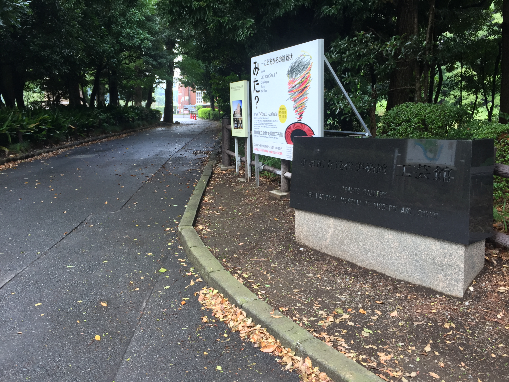\
\
## National Archives of Japan
Anyway, I carried on to visit my next
place in my list - intermediatheque by UTokyo. In the half-way, I saw
the National Archives of Japan and visited it. It preserved a lots of
rescript of promulgations. In the museum, you can find the contracts and
laws which witnessed the developments of Japan\'s politics and the big
events in the history.\
\
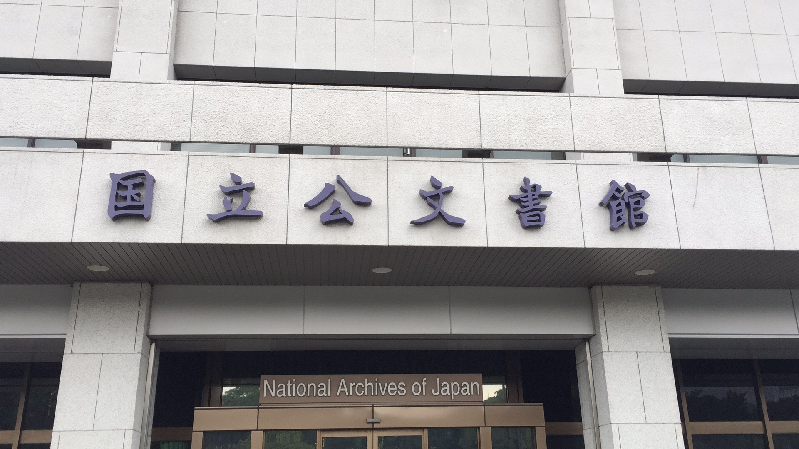\
\
## Intermediatheque
It has exceeded my expectation definitely also.
The intermediatheque comprises all the most valuable collections in UMUT
(the Universal Museum of the University of Tokyo), telling you the story
of the history by showing you the true ones but not replicas. As the
director of UMUT said, the dated matters in the history strokes should
never be forgotten. By visiting the museum, I came to a sense of
stepping into the 19^th^ century. Taking photos was not allowed in
museum in any forms, therefore, I have no photos but one of entry.\
\
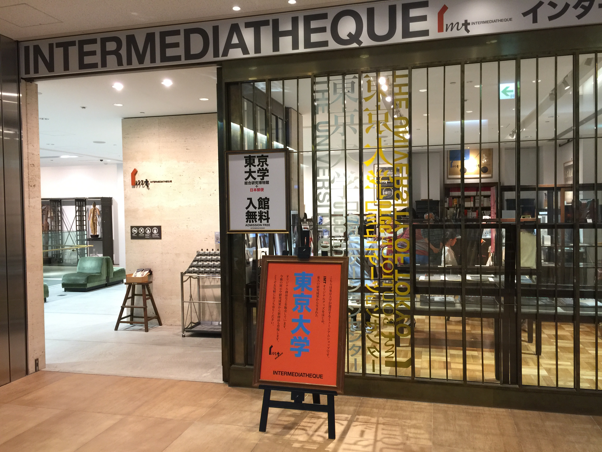\
\
**\*** First Floor Inside the museum, on the first floor in
intermediatheque (second floor in KITTE commercial complex), I saw a
full sight of different kind of fossils and specimens of various kind of
species, including reptiles, amphibians, insects, vertebrates,
invertebrates, mammal and plants. They mainly came from the UMUT anatomy
branch. They were not only the fossils and specimens but also the
narrator of the history. Some of them were bought by professors of
UTokyo for the purpose of researching while some of others were captured
and framed by the students or professors themselves at Tokyo. You see
not only the specimens themselves, but also the strokes in history that
they have brushed. Then, I moved on to the next section in which I saw
many different kind of artifacts and the productions which marked the
highest standard and capability of the technologies in that time. For
example, you can see one elevator that Albert Einstein once used in
Tokyo university when he was visiting Japan to attend the conferences
which were held in Tokyo university after he was awarded with the Nobel
prize of Physics. On the rusty board of elevator, you can see through
the history.\
**\*** Second Floor Then I went to the next floor in which many dated
equipment and artifacts had been shown. In this section, you can see the
history of UTokyo. My favorite collection is a set of sculptures for
mathematics department. Of course not for depicting the professor. They
were used for researching and teaching in the field which concentrates
on the complex functions and surface because there was no computer
simulation or plotting in 19^th^ or early 20^th^ century and the
sculptures of the complex surface were needed since functions are just
intricate. They were beautiful and interpreted the mathematics in an
elegant way. There were also other collections for dynamics and
mechanics physics, I will just skip these.\
## HHKB Yes!
After the great experience in intermediatheque, I went to
the Bic Camera which is a big store compounds almost any electronics. I
was interested by neither computers nor cellphones but accessories like
- keyboards!

> Cowboys in the western United States leave their horses when they die.
> But never leave their saddles, regardless of how long they need to
> walk in the desert. Saddles are interfaces that are deeply adapted to
> our bodies whereas horses are consumable items. It should not be
> forgotten that computers are consumables nowadays, but keyboards are
> interfaces that we can use through our lives.\
> -- Eiiti Wada, Professor Emeritus at the University of Tokyo

HHKB (Happy Hacking Keyboard) is a kind of specialty of Japan among the
programmers, developers and IT practitioners. I\'m not the exception
either. So I bought one HHKB Professional JP (PD-KB420W) since it was
CNY 700 cheaper than the price of Professional 2 in China and the JP
version is not provided in China.\
\
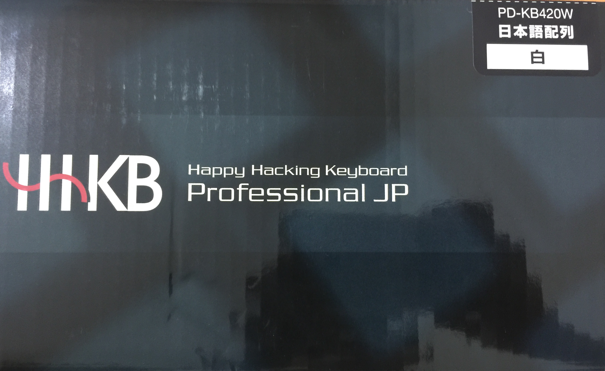\
\
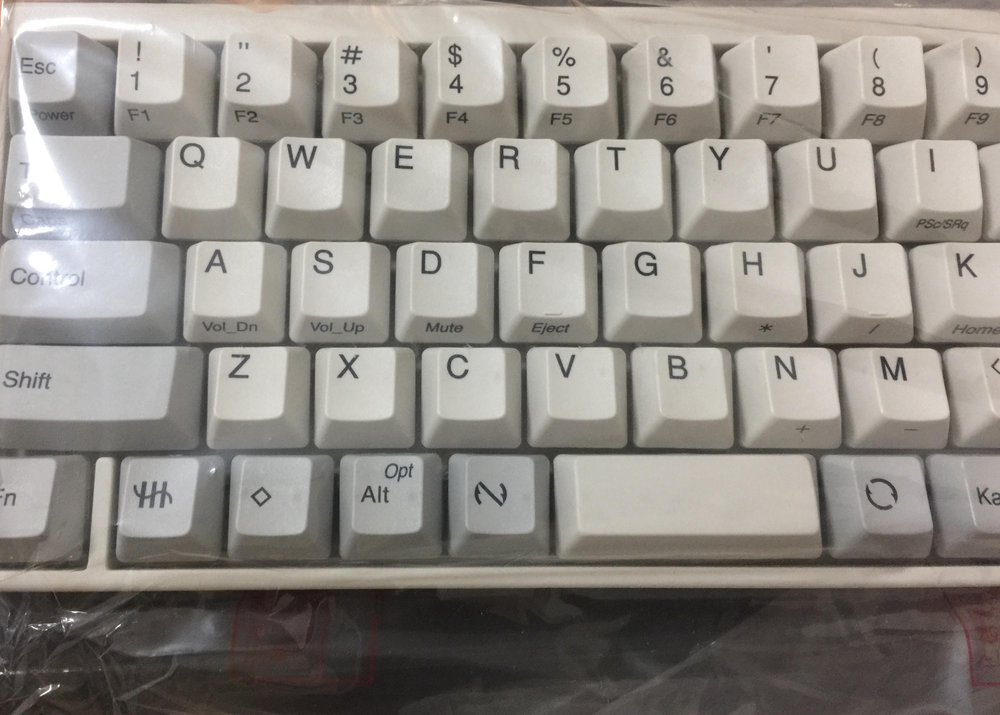\
\
## Asakura Temple
In the end, I went to the Asakura Temple which is a
famous spot in Japan but not only a temple. I got a fortune stick. Here
was what my stick said.\
\
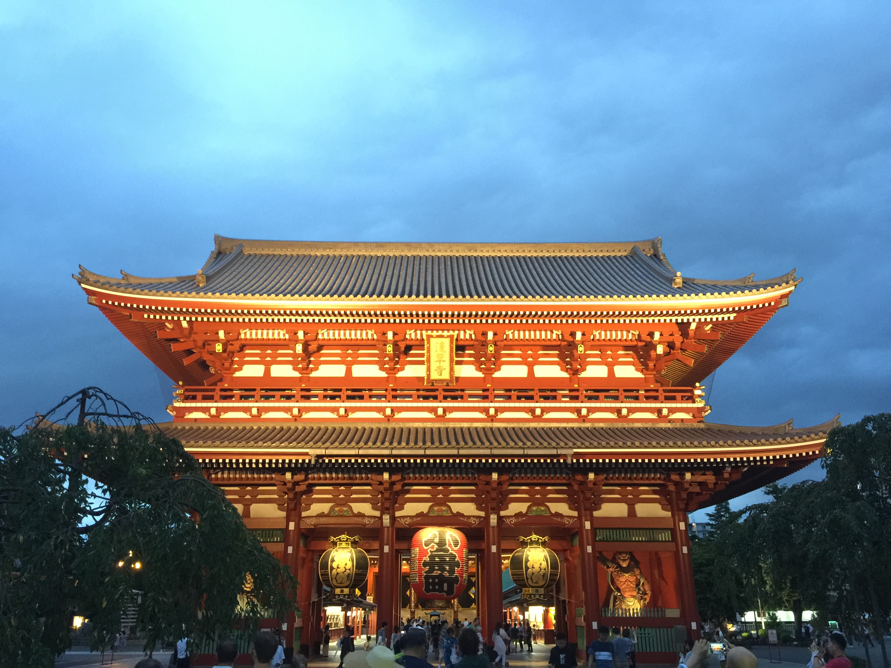\
\
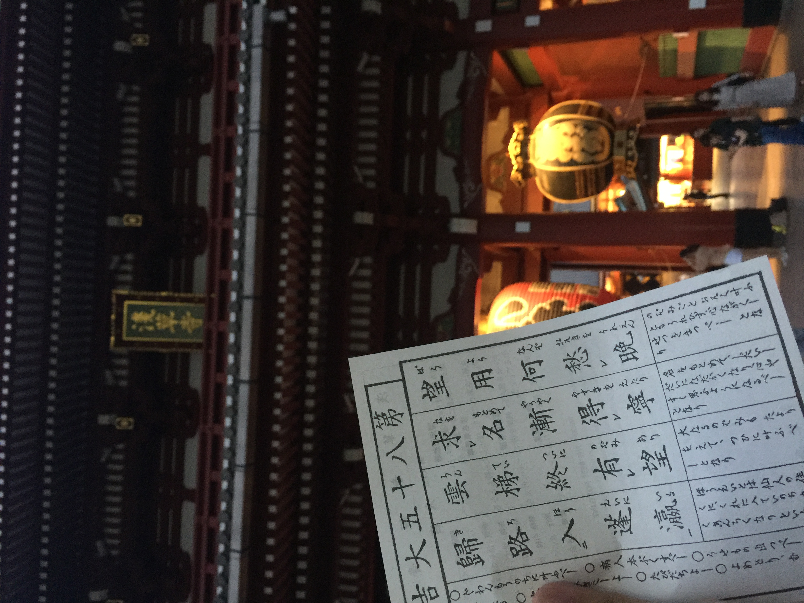\
\

# Day 4
On day 4, I went to the Tokyo National Museum in which there
were a lot of national treasures and different types of collections
which reflect the history of Japan. From these different culture
heritages, I found out the Japanese culture was actually a combination
of various Asian cultures such as Chinese culture, the Buddhism and the
Korean culture. These culture composed the Japanese culture and exerted
influence on it until meiji. The Chinese culture, of course, exerted its
influence on Japanese culture mostly. From the collections which were
created in Tang Dynasty, you can easily see the presences of Chinese
figures, characters and stories even verses.\
Buddhism had a very intriguing position in Japanese culture history of
development. It was introduced to Japan at a very beginning time of
Japanese history. The time of the Neolithic age even. Several kinds of
sculpture of Buddhists were presented as the symbols of distributing of
Buddhism in Neolithic age in Japan in the museum. Later it began to
prosper again in Japan in the Edo period since the Buddhism became
prestigious in Japan by the praising of the Tokugawa Shogunate.\
You can also find many Chinese stories or characters in the museum as I
mentioned above. They became a quite hot and predominant topics of both
painting and writing in the period corresponding to the Tang Dynasty of
China. Also, the photo taking is prohibited in the museum, thus I have
no photos. What a sad.\
In the afternoon, one tragedy came. My Wi-Fi ran out of battery thus I
had disconnected from the whole world. It was a such a troublesomne
problem that I had to solve it as soon as possible. I went to the Family
Mart by finding the route on Google Maps by using the free Wi-Fi of the
museum. Then I had no alternative but to bought a charging cable. It
costed JPY 1000! What a horrible and terrifying story. Anyway, I got the
Wi-Fi then.\
After I solved the problem, I carried on to the Shinjuku Express Bus
Terminal to buy a round ticket for my Mountain Fuji trip.\
That\'s the day.

# Day 5

As I mentioned yesterday, I would go to the mountain Fuji today. I slept
for a while after catching the highway bus. My bus took me to the 5^th^
station of mountain Fuji.\
I was supposed to stay and tour around the 5^th^ station as my previous
plan. However, I decided temporarily that I would try to hike for a
while to reach the 7^th^ station in order to enjoy myself to full. And,
more importantly, I had not got any professional equipment of hiking
such as boots or alpenstock. Therefore, I was entitled with \"hiking
without preparedness\" in a way by myself later on.\
Then, I went to hiking with a map, a bottle of water and a bag with a
camera and other stuffs inside.\
This is an overview of the Fuijisan captured from 5^th^ station.\
\
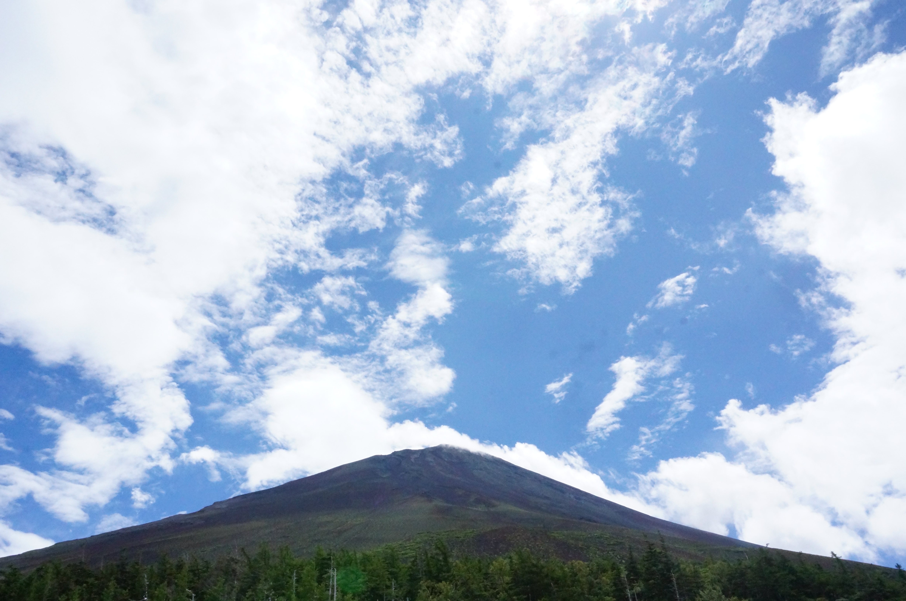\
\
The trail between the 5^th^ adn 6^th^ station was quite easy to climb
and \"flat\" in a way. And this is a pano took from the trail between
them.\
\
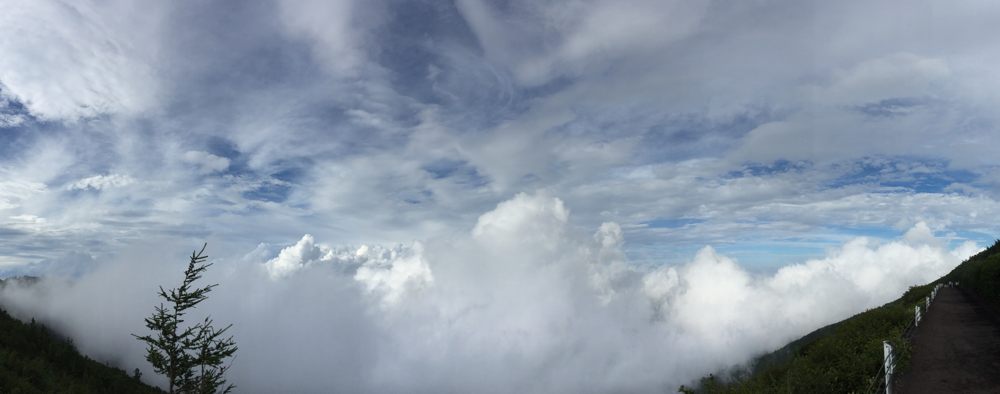\
\
As you can see from the picture, the altitude of that position at which
I took the picture was actually the same as the clouds.\
Then I continued to hike on the trail, after the 6^th^ station, I found
the difference. The trail between the 6^th^ station and the 7^th^
station was somehow a kind of steep. Furthermore, the land under my
boots comprised limestone and sandstone, which was very slippery and
dangerous if you haven\'t got a pair of hiking boots. So my journey was
actually very thrill.\
\
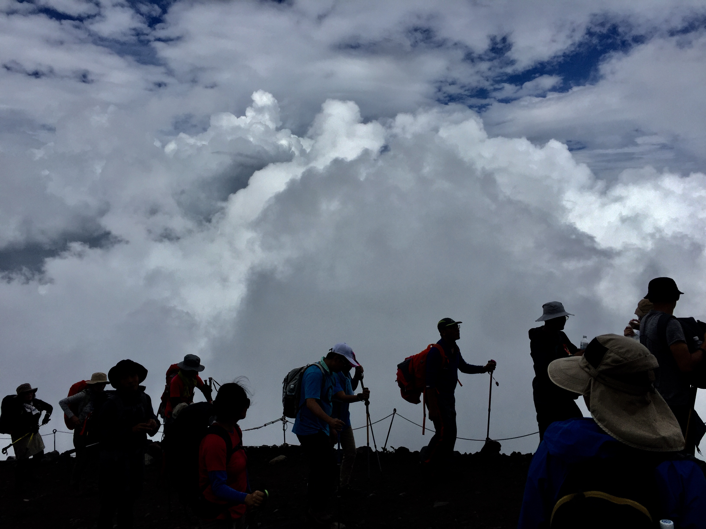\
\
In the end, I had done my hiking by climbing to the 7^th^ station.

# Day 6

On day 6, I got nothing to do but staying at my residential because I
thought I had no regret about Tokyo and I was at a kind of tiredness.\
In the evening, I checked in a hotel near the airport due to the early
flight I would take.

# Day 7

It\'s the final day on which I stayed at Tokyo. Actually, I went to the
Narita Airport by 5:40 and checked in later. The return journey was
boring so I won\'t describe it in detail.

# Conclusion

I have got deep impressions about my journey of Tokyo.\
Tokyo, as one of the most prosperous cities of Asia, is very flourishing
while busying and steaming in order. Everything goes on in a fast pace
but orderly. The bus, metro, trains, crossing, they all runs on their
own time.\
In this typical Asian fast-pace metropolitan, I could easily feel the
tenderness and the nervous scattered in the city air as it was breathed
and inhaled again and again. This stifling atmosphere leads to the high
suicide ratio and many different mental illnesses.\
Furthermore, most Asians have introverted personality, Japan has got no
exception. Also you may find that Japanese are welcome in some aspects,
but they are not the kind of people which are outgoing and that positive
or sunshine. This is very different from the American style metropolitan
-- New York City.\
To sum up, Tokyo is an Asian style metropolitan which is composed of the
Asian-like personalities and the modern ways of thinking and working,
which were derived from western.\
This is Japan.
